# Epam External Project by Volodymyr Verholyak
## Суть проекту: побудувати CI\CD процес
* Tools які я використав в проекті:

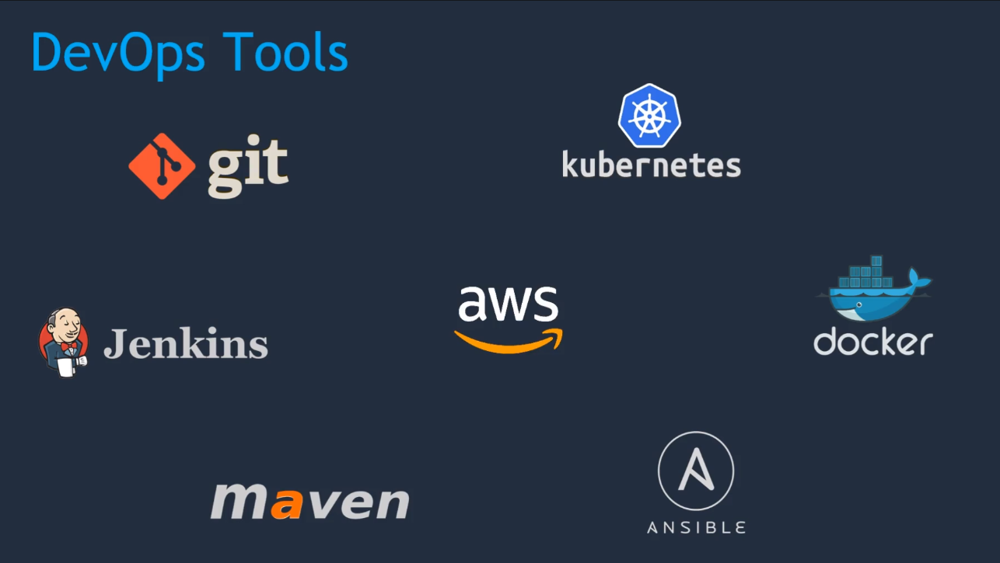

* Основна схема роботи: 

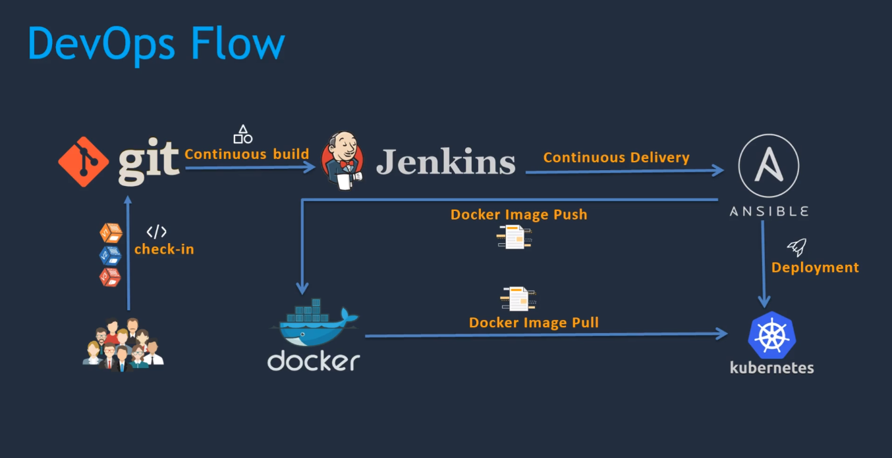


## I Етап

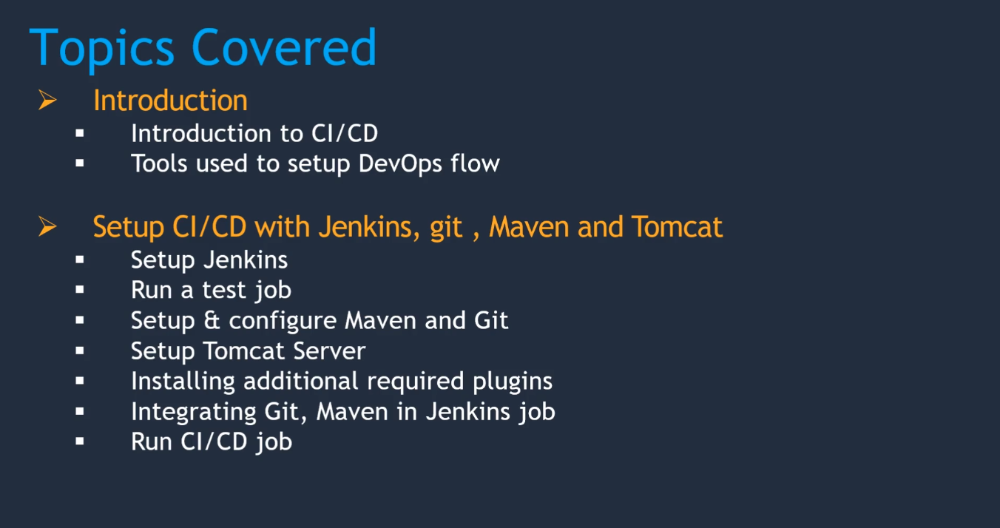
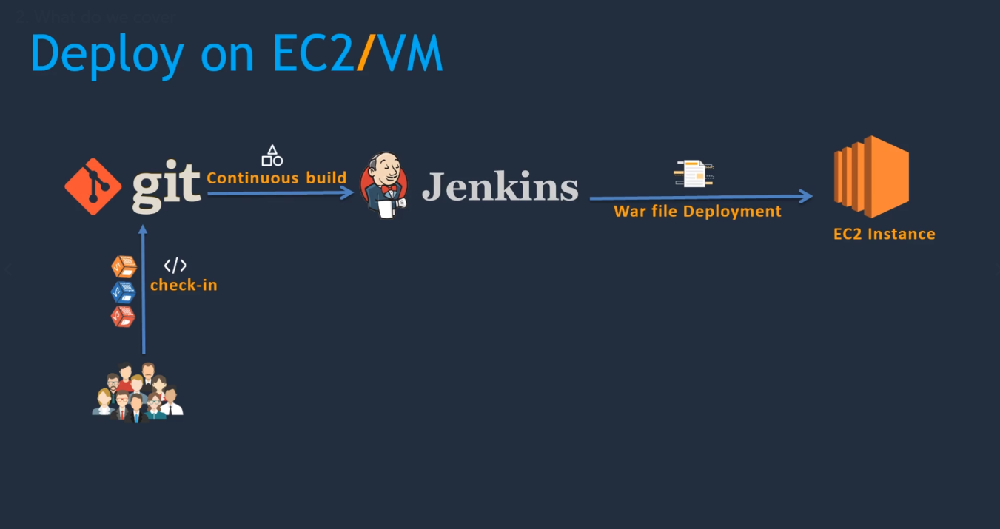

# Install Jenkins on AWS EC2
Jenkins is a self-contained Java-based program, ready to run out-of-the-box, with packages for Windows, Mac OS X and other Unix-like operating systems. As an extensible automation server, Jenkins can be used as a simple CI server or turned into the continuous delivery hub for any project.


### Prerequisites
1. EC2 Instance 
   - With Internet Access
   - Security Group with Port `8080` open for internet
1. Java v1.8.x 

## Install Java
1. We will be using open java for our demo, Get the latest version from http://openjdk.java.net/install/
   ```sh
   yum install java-1.8*
   #yum -y install java-1.8.0-openjdk-devel
   ```

1. Confirm Java Version and set the java home
   ```sh
   java -version
   find /usr/lib/jvm/java-1.8* | head -n 3
   JAVA_HOME=/usr/lib/jvm/java-1.8.0-openjdk-<Java version which seen in the above output>
   export JAVA_HOME
   PATH=$PATH:$JAVA_HOME
    # To set it permanently update your .bash_profile
   vi ~/.bash_profile
   ```
   _The output should be something like this,_
    ```sh
   [root@~]# java -version
   openjdk version "1.8.0_151"
   OpenJDK Runtime Environment (build 1.8.0_151-b12)
   OpenJDK 64-Bit Server VM (build 25.151-b12, mixed mode)
   ```

## Install Jenkins
 You can install jenkins using the rpm or by setting up the repo. We will set up the repo so that we can update it easily in the future.
1. Get the latest version of jenkins from https://pkg.jenkins.io/redhat-stable/ and install
   ```sh
   yum -y install wget
   sudo wget -O /etc/yum.repos.d/jenkins.repo https://pkg.jenkins.io/redhat-stable/jenkins.repo
   sudo rpm --import https://pkg.jenkins.io/redhat-stable/jenkins.io.key
   yum -y install jenkins
   ```

   ### Start Jenkins
   ```sh
   # Start jenkins service
   service jenkins start

   # Setup Jenkins to start at boot,
   chkconfig jenkins on
   ```

   ### Accessing Jenkins
   By default jenkins runs at port `8080`, You can access jenkins at
   ```sh
   http://YOUR-SERVER-PUBLIC-IP:8080
   ```
  #### Configure Jenkins
- The default Username is `admin`
- Grab the default password 
- Password Location:`/var/lib/jenkins/secrets/initialAdminPassword`
- `Skip` Plugin Installation; _We can do it later_
- Change admin password
   - `Admin` > `Configure` > `Password`
- Configure `java` path
  - `Manage Jenkins` > `Global Tool Configuration` > `JDK`  

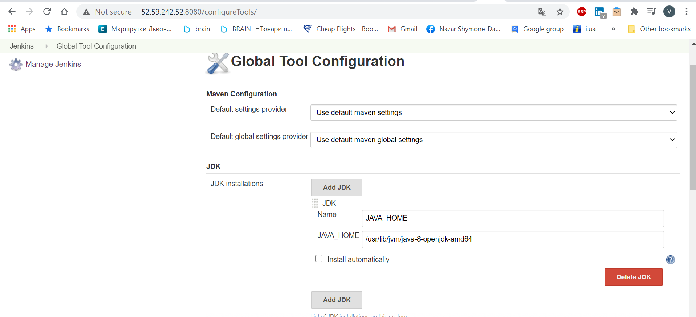

- Create another admin user id

### Test Jenkins Jobs
1. Create “new item”
1. Enter an item name – `My-First-Project`
   - Chose `Freestyle` project
1. Under the Build section
	Execute shell: echo "Welcome to Jenkins Demo"
1. Save your job 
1. Build job
1. Check "console output"

-------------------------------------------------------------

### First run test job

# Configure Git pulgin on Jenkins
Git is one of the most popular tools for version control system. you can pull code from git repositories using jenkins if you use github plugin. 


#### Prerequisites
1. Jenkins server 

#### Install Git on Jenkins server
1. Install git packages on jenkins server
   ```sh
   yum install git -y
   ```

#### Setup Git on jenkins console
- Install git plugin without restart  
  - `Manage Jenkins` > `Jenkins Plugins` > `available` > `github`

- Configure git path
  - `Manage Jenkins` > `Global Tool Configuration` > `git`

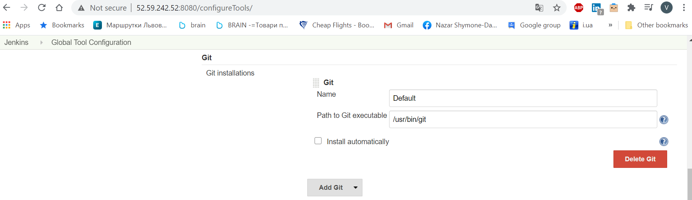

-------------------------------------------------------------

#  Install & configure Maven build tool on Jenkins
Maven is a code build tool which used to convert your code to an artifact. this is a widely used plugin to build in continuous integration


#### Prerequisites
1. Jenkins server

#### Install Maven on Jenkins
1. Download maven packages https://maven.apache.org/download.cgi onto Jenkins server. In this case, I am using /opt/maven as my installation directory
 - Link : https://maven.apache.org/download.cgi
    ```sh
     # Creating maven directory under /opt
     mkdir /opt/maven
     cd /opt/maven
     # downloading maven version 3.6.0
     wget http://mirrors.estointernet.in/apache/maven/maven-3/3.6.1/binaries/apache-maven-3.6.1-bin.tar.gz
     tar -xvzf apache-maven-3.6.1-bin.tar.gz
     ```
	
1. Setup M2_HOME and M2 paths in .bash_profile of the user and add these to the path variable
   ```sh
   vi ~/.bash_profile
   M2_HOME=/opt/maven/apache-maven-3.6.1
   M2=$M2_HOME/bin
   PATH=<Existing_PATH>:$M2_HOME:$M2
   ```
#### Checkpoint 
1. logoff and login to check maven version
  
    ```sh
    mvn --version
    ```
So far we have completed the installation of maven software to support maven plugin on the jenkins console. Let's jump onto Jenkins to complete the remaining steps. 

### Setup maven on Jenkins console
1. Install maven plugin without restart  
  - `Manage Jenkins` > `Jenkins Plugins` > `available` > `Maven Invoker`
  - `Manage Jenkins` > `Jenkins Plugins` > `available` > `Maven Integration`

2. Configure maven path
  - `Manage Jenkins` > `Global Tool Configuration` > `Maven`

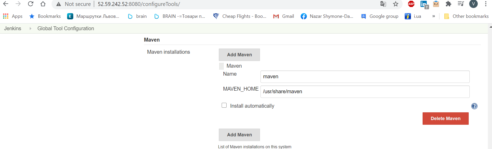

### Create first maven job

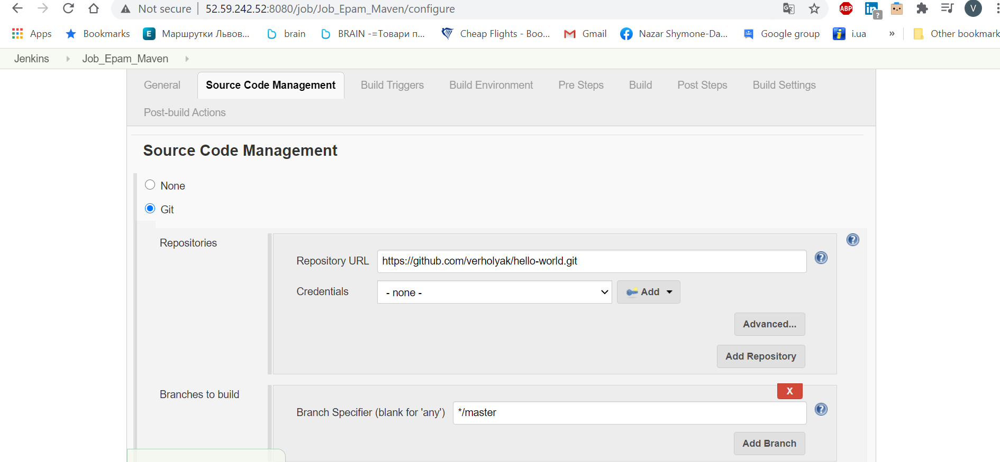
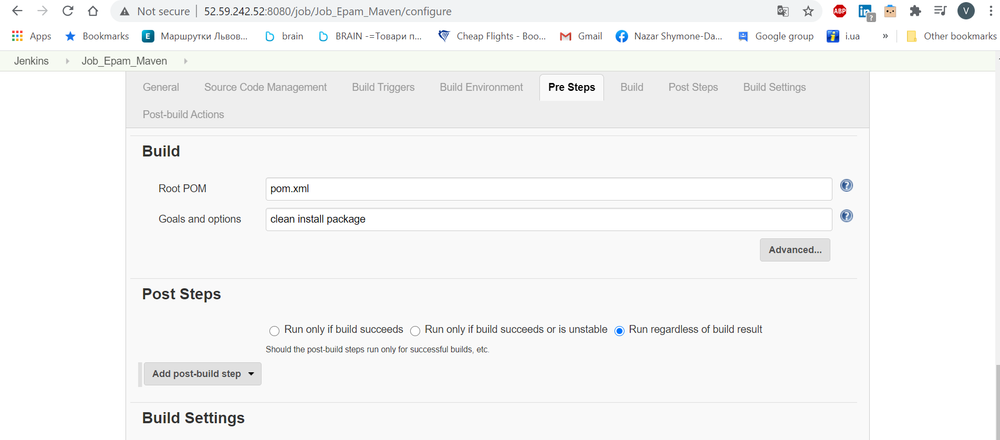

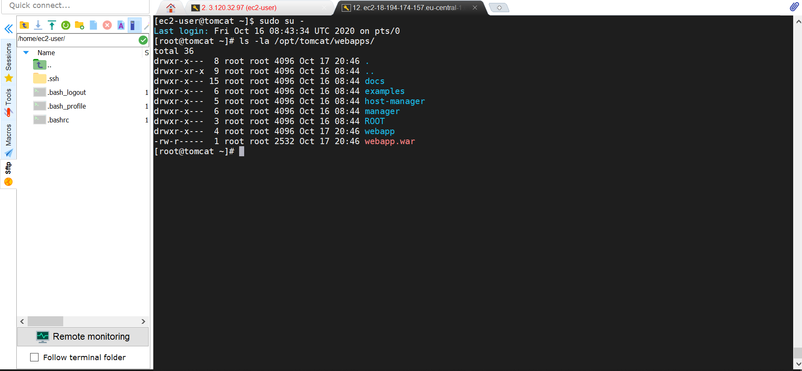

-------------------------------------------------------------

# Tomcat installation on EC2 instance

### Pre-requisites
1. EC2 instance with Java v1.8.x 

### Install Apache Tomcat
1. Download tomcat packages from  https://tomcat.apache.org/download-80.cgi onto /opt on EC2 instance
   ```sh 
   # Create tomcat directory
   cd /opt
   wget http://mirrors.fibergrid.in/apache/tomcat/tomcat-8/v8.5.35/bin/apache-tomcat-8.5.35.tar.gz
   tar -xvzf /opt/apache-tomcat-8.5.35.tar.gz
   ```
1. give executing permissions to startup.sh and shutdown.sh which are under bin. 
   ```sh
   chmod +x /opt/apache-tomcat-8.5.35/bin/startup.sh 
   shutdown.sh
   ```

1. create link files for tomcat startup.sh and shutdown.sh 
   ```sh
   ln -s /opt/apache-tomcat-8.5.35/bin/startup.sh /usr/local/bin/tomcatup
   ln -s /opt/apache-tomcat-8.5.35/bin/shutdown.sh /usr/local/bin/tomcatdown
   tomcatup
   ```
  #### Check point :
access tomcat application from browser on port 8080  
 - http://<Public_IP>:8080

  Using unique ports for each application is a best practice in an environment. But tomcat and Jenkins runs on ports number 8080. Hence lets change tomcat port number to 8090. Change port number in conf/server.xml file under tomcat home
   ```sh
 cd /opt/apache-tomcat-8.5.35/conf
# update port number in the "connecter port" field in server.xml
# restart tomcat after configuration update
tomcatdown
tomcatup
```
#### Check point :
Access tomcat application from browser on port 8090  
 - http://<Public_IP>:8090

1. now application is accessible on port 8090. but tomcat application doesnt allow to login from browser. changing a default parameter in context.xml does address this issue
   ```sh
   #search for context.xml
   find / -name context.xml
   ```
1. above command gives 3 context.xml files. comment (<!-- & -->) `Value ClassName` field on files which are under webapp directory. 
After that restart tomcat services to effect these changes
   ```sh 
   tomcatdown
   tomcatup
   ```
1. Update users information in the tomcat-users.xml file
goto tomcat home directory and Add below users to conf/tomcat-user.xml file
   ```sh
	<role rolename="manager-gui"/>
	<role rolename="manager-script"/>
	<role rolename="manager-jmx"/>
	<role rolename="manager-status"/>
	<user username="admin" password="admin" roles="manager-gui, manager-script, manager-jmx, manager-status"/>
	<user username="deployer" password="deployer" roles="manager-script"/>
	<user username="tomcat" password="s3cret" roles="manager-gui"/>
   ```
1. Restart serivce and try to login to tomcat application from the browser. This time it should be Successful

### Config TomCat from Jenkins

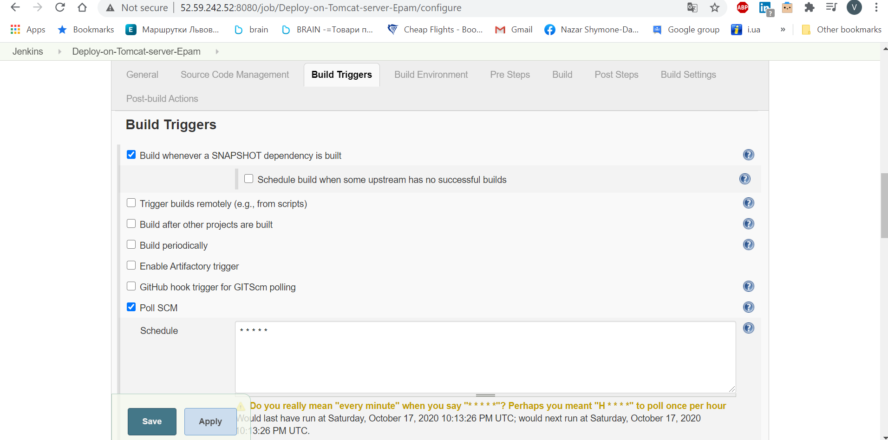
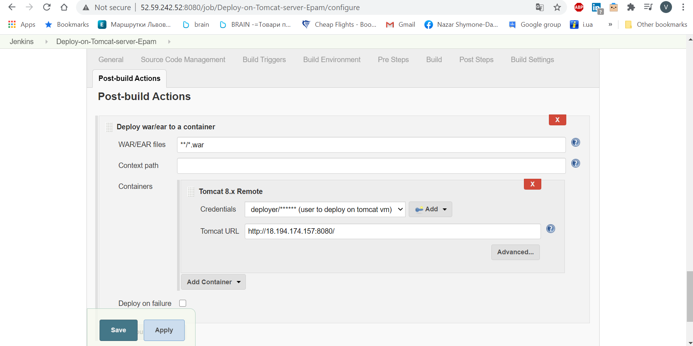
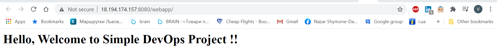

------------------------------------------------------------

## II Етап

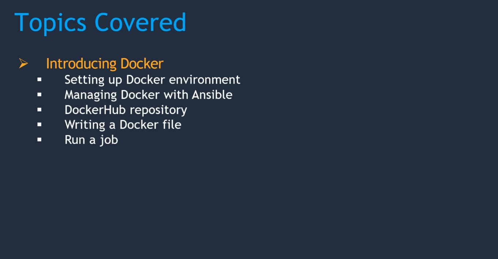
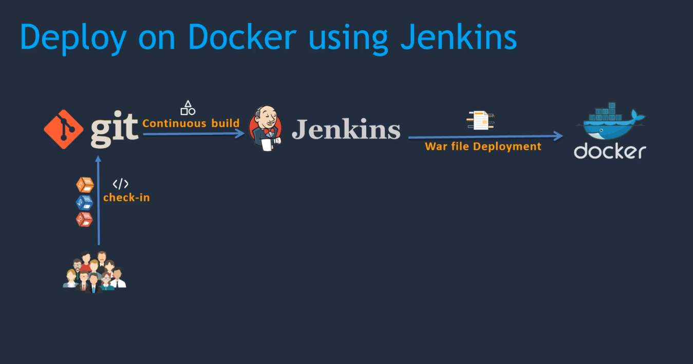

-------------------------------------------------------------

# Installing Docker on Amazon Linux server

### Pre-requisites
1. Amazon Linux EC2 Instance

## Installation Steps

1. Install docker and start docker services
   ```sh 
   yum install docker -y
   docker --version 
   
   # start docker services
   service docker start
   service docker status
   ```
1. Create a user called dockeradmin
   ```sh
   useradd dockeradmin
   passwd dockeradmin
   ```
1. add a user to docker group to manage docker 
   ```
   usermod -aG docker dockeradmin
   ```

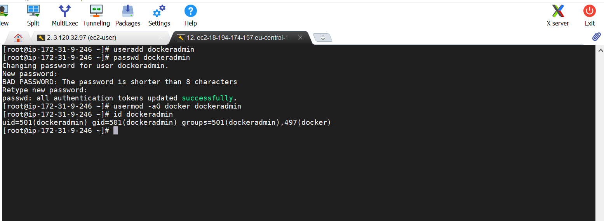

* nano /etc/ssh/sshd_config

```
# EC2 uses keys for remote access
PasswordAuthentication yes
#PermitEmptyPasswords no
```
* service sshd reload
* Manage Jenkins > Configure System

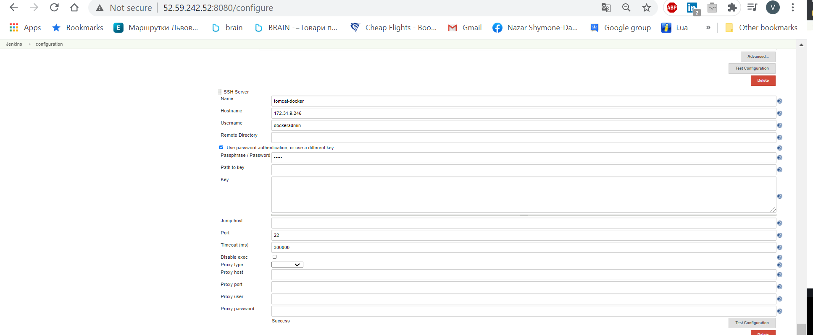

* create deploy job on jenlins
    * /var/lib/jenkins/workspace/Deploy-on-Tomcat-server-Epam/webapp/target - send build artifact over SSH to jenkins server
    * webapp/target/*.war - copo to job

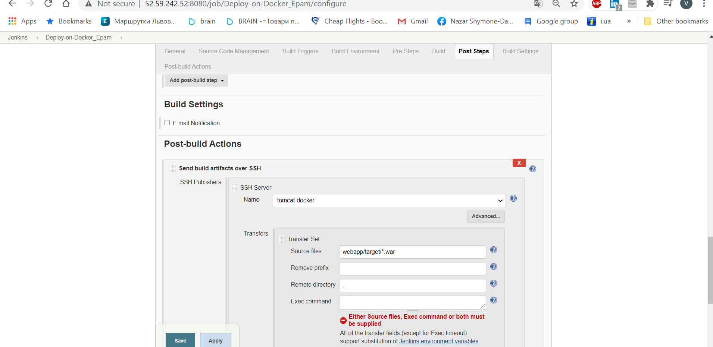

# Create Dockerfile

* nano Dockerfile
```
FROM tomcat:8.0

MAINTAINER Vova Verholyak

COPY ./webapp.war /usr/local/tomcat/webapps
```
* docker build -t devops-project .
* docker run -d -p 8080:8080 devops-project

### Deploy to Container

* Create job "Deploy-on-Container"
* add comand > cd /home/dockeradmin; docker build -t devops-image .; docker run -d -p 8080:8080 devops-image;

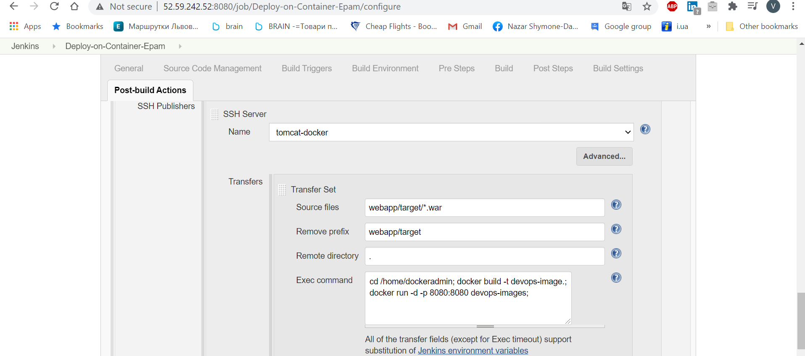

### Validation test
1. Create a tomcat docker container by pulling a docker image from the public docker registry
   ```sh
   docker run -d --name test-tomcat-server -p 8090:8080 tomcat:latest
   ```

## Docker Installation on CentOS server
##### Referance URL : https://docs.docker.com/install/linux/docker-ce/centos/#install-using-the-repository
### Pre-requisites

Please follow below steps to install docker CE on CentoOS server instance. For RedHat only Docker EE available 

1. Install the required packages.

   ```sh 
   sudo yum install -y yum-utils \
   device-mapper-persistent-data \
   lvm2
   ```
  
1. Use the following command to set up the stable repository.
 
   ```sh 
   sudo yum-config-manager \
   --add-repo \
   https://download.docker.com/linux/centos/docker-ce.repo
   ```

### INSTALLING DOCKER CE

1. Install the latest version of Docker CE.
   ```sh 
   sudo yum install docker-ce
   ```

   Note: If prompted to accept the GPG key, verify that the fingerprint matches 
060A 61C5 1B55 8A7F 742B 77AA C52F EB6B 621E 9F35, and if so, accept it.

1. Start Docker.
   ```sh 
   sudo systemctl start docker
   ```

1. Verify that docker is installed correctly by running the hello-world image.
   ```sh
   sudo docker run hello-world
   ```

------------------------------------------------------------


## III Етап: Ansible -> Docker

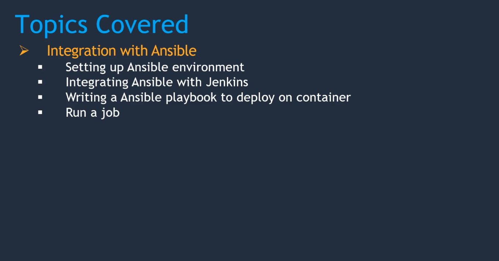
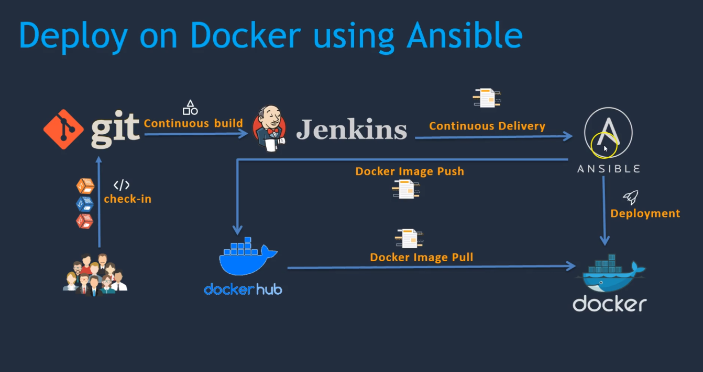

---------------------------------------------------------------------------

# Ansible Installation

Ansible is an open-source automation platform. It is very, very simple to set up and yet powerful. Ansible can help you with configuration management, application deployment, task automation.

### Pre-requisites

1. An AWS EC2 instance (on Control node)

### Installation steps:
#### on Amazon EC2 instance

1. Install python and python-pip
   ```sh
   yum install python
   yum install python-pip
   ```
1. Install ansible using pip check for version
    ```sh
    pip install ansible
   ansible --version
   mkdir /etc/ansible
   ```
   
1. Create a user called ansadmin (on Control node and Managed host)  
   ```sh
   useradd ansadmin
   passwd ansadmin
   ```
1. Below command grant sudo access to ansadmin user. But we strongly recommended using "visudo" command if you are aware vi or nano editor.  (on Control node and Managed host)
   ```sh
   echo "ansadmin ALL=(ALL) NOPASSWD: ALL" >> /etc/sudoers
   ```
   
1. Log in as a ansadmin user on master and generate ssh key (on Control node)
   ```sh 
   sudo su - ansadmin
   ssh-keygen
   ```
1. Copy keys onto all ansible managed hosts (on Control node)
   ```sh 
   ssh-copy-id ansadmin@<target-server>
   ```

1. Ansible server used to create images and store on docker registry. Hence install docker, start docker services and add ansadmin to the docker group. 
   ```sh
   yum install docker
   
   # start docker services 
   service docker start
   service docker start 
   
   # add user to docker group 
   usermod -aG docker ansadmin

   ```
1. Create a directory /etc/ansible and create an inventory file called "hosts" add control node and managed hosts IP addresses to it. 
 
### Validation test

   
1. Run ansible command as ansadmin user it should be successful (Master)
   ```sh 
   ansible all -m ping
   ```

## IV Етап: Ansible -> Kubernetes

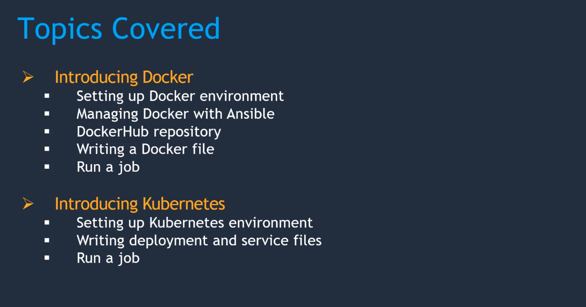
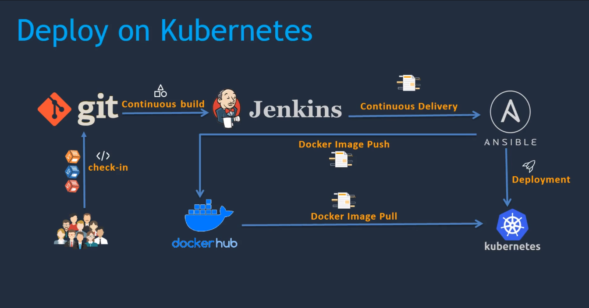

# Setup Kubernetes (K8s) Cluster on AWS


1. Create Ubuntu EC2 instance
1. install AWSCLI
   ```sh
    sudo apt-get update
    curl https://s3.amazonaws.com/aws-cli/awscli-bundle.zip -o awscli-bundle.zip
    apt install unzip python
    unzip awscli-bundle.zip
    #sudo apt-get install unzip - if you dont have unzip in your system
    ./awscli-bundle/install -i /usr/local/aws -b /usr/local/bin/aws
    ```

1. Install kubectl on ubuntu instance
   ```sh
   curl -LO https://storage.googleapis.com/kubernetes-release/release/$(curl -s https://storage.googleapis.com/kubernetes-release/release/stable.txt)/bin/linux/amd64/kubectl
    chmod +x ./kubectl
    sudo mv ./kubectl /usr/local/bin/kubectl
   ```

1. Install kops on ubuntu instance
   ```sh
    curl -LO https://github.com/kubernetes/kops/releases/download/$(curl -s https://api.github.com/repos/kubernetes/kops/releases/latest | grep tag_name | cut -d '"' -f 4)/kops-linux-amd64
    chmod +x kops-linux-amd64
    sudo mv kops-linux-amd64 /usr/local/bin/kops
    ```
1. Create an IAM user/role  with Route53, EC2, IAM and S3 full access

1. Attach IAM role to ubuntu instance
   ```sh
   # Note: If you create IAM user with programmatic access then provide Access keys. Otherwise region information is enough
   aws configure
    ```

1. Create a Route53 private hosted zone (you can create Public hosted zone if you have a domain)
   ```sh
   Routeh53 --> hosted zones --> created hosted zone  
   Domain Name: valaxy.net
   Type: Private hosted zone for Amzon VPC
   ```

1. create an S3 bucket
   ```sh
    aws s3 mb s3://demo.k8s.valaxy.net
   ```
1. Expose environment variable:
   ```sh
    export KOPS_STATE_STORE=s3://demo.k8s.valaxy.net
   ```

1. Create sshkeys before creating cluster
   ```sh
    ssh-keygen
   ```

1. Create kubernetes cluster definitions on S3 bucket
   ```sh
   kops create cluster --cloud=aws --zones=ap-south-1b --name=demo.k8s.valaxy.net --dns-zone=valaxy.net --dns private 
    ```

1. Create kubernetes cluser
    ```sh
    kops update cluster demo.k8s.valaxy.net --yes
    ```

1. Validate your cluster
     ```sh
      kops validate cluster
    ```

1. To list nodes
   ```sh
   kubectl get nodes
   ```

1. To delete cluster
    ```sh
     kops delete cluster demo.k8s.valaxy.net --yes
    ```
   
#### Deploying Nginx pods on Kubernetes
1. Deploying Nginx Container
    ```sh
    kubectl run sample-nginx --image=nginx --replicas=2 --port=80
    # kubectl run simple-devops-project --image=yankils/simple-devops-image --replicas=2 --port=8080
    kubectl get pods
    kubectl get deployments
   ```

1. Expose the deployment as service. This will create an ELB in front of those 2 containers and allow us to publicly access them.
   ```sh
   kubectl expose deployment sample-nginx --port=80 --type=LoadBalancer
   # kubectl expose deployment simple-devops-project --port=8080 --type=LoadBalancer
   kubectl get services -o wide
   ```

## Ідея CI/CD процеса:

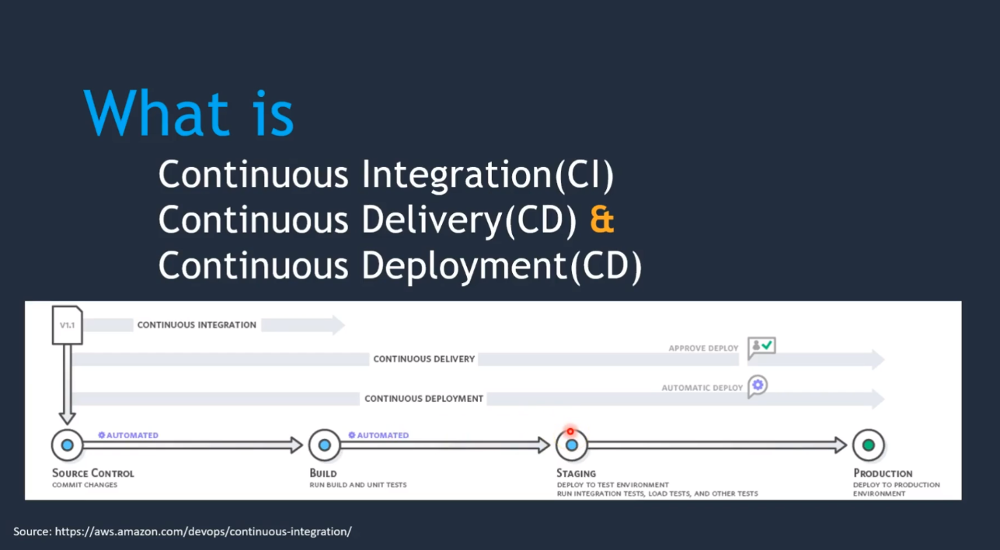

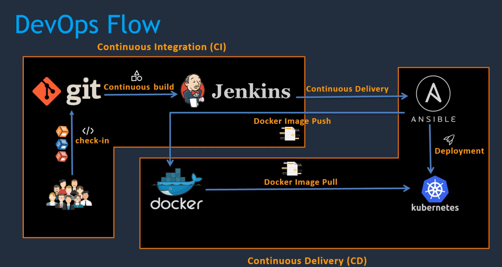

